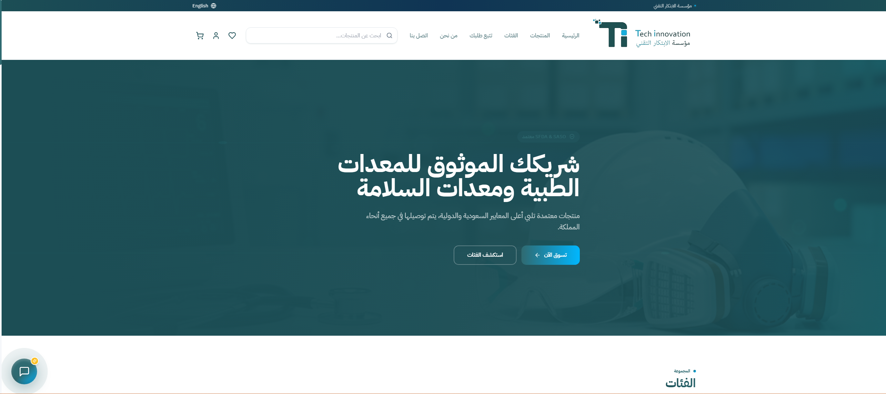
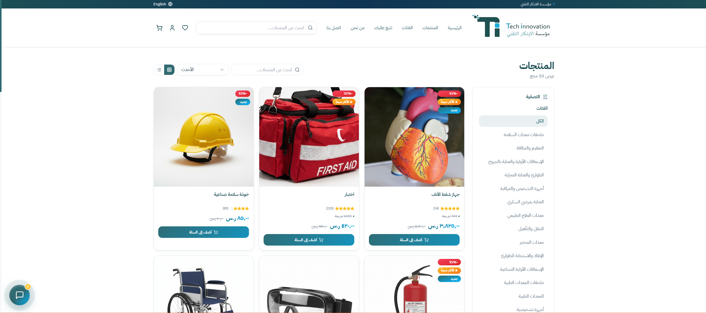
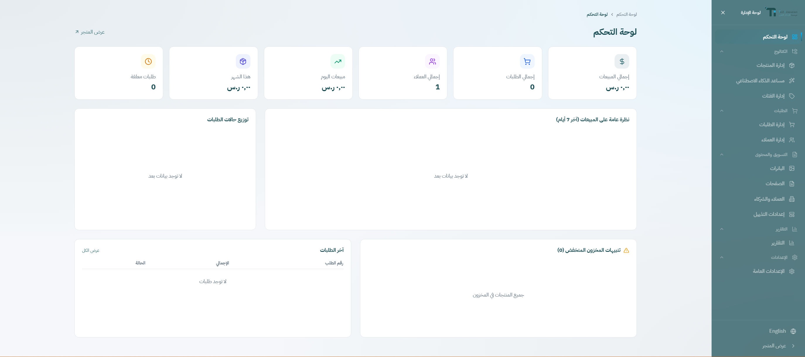
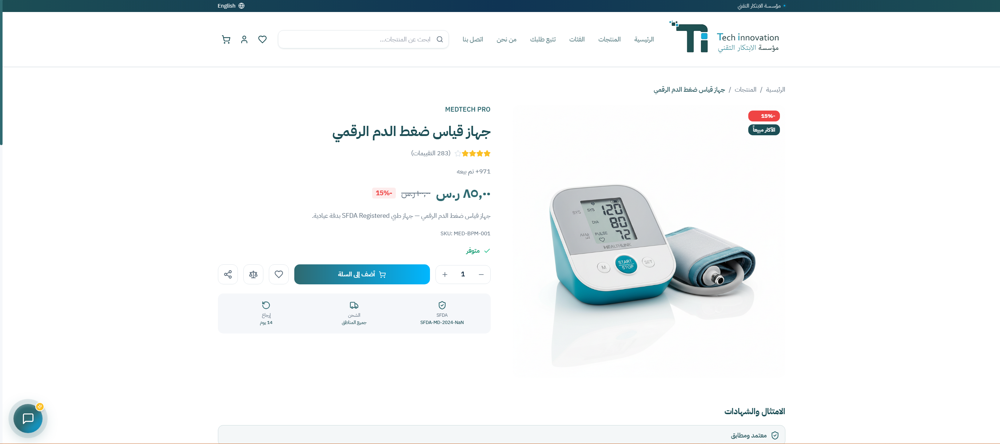

# Tech Innovation 🏥

A comprehensive E-commerce platform for selling medical devices and industrial safety equipment in the Kingdom of Saudi Arabia, built completely from scratch using Django REST Framework and React.



## 📋 Overview

Tech Innovation is a bilingual (Arabic/English) platform compliant with SFDA and SASO Saudi standards. It allows users to securely browse and purchase medical equipment, backed by a full admin dashboard for store management.

## ✨ Features

- 🛒 Full E-Commerce Store (Browsing, Search, Filtering, Cart, Checkout)
- 🔐 Complete Authentication System (Registration + OTP Verification + JWT)
- 📦 Real-Time Order Tracking (WebSocket)
- 👨‍💼 Comprehensive Admin Dashboard (Products, Categories, Orders)
- 🖼️ Multi-Image Product Uploads
- 💰 Automatic & Secure Server-Side VAT Calculation
- 🎟️ Discount Coupon System
- 🌐 Full Arabic Support (RTL) & English Support

## 🛠️ Tech Stack

**Backend:**
- Python / Django / Django REST Framework
- Simple JWT (Authentication)
- Django Channels (WebSocket)
- SQLite (Development)

**Frontend:**
- React + Vite
- Tailwind CSS
- React Router
- Axios

## 📸 Screenshots

### Home Page


### Products Page


### Admin Dashboard


### Product Details


## 🚀 Local Setup

### Backend
```bash
cd backend
python -m venv venv
venv\Scripts\activate       # Windows
pip install -r requirements.txt
python manage.py migrate
python manage.py createsuperuser
python manage.py runserver


### Frontend

Bash
cd frontend
npm install
npm run dev


Backend: http://127.0.0.1:8000

Frontend: http://localhost:5173


📁 Project Structure

tech-innovation/
├── backend/          # Django REST API
│   └── apps/
│       ├── users/
│       ├── products/
│       ├── categories/
│       ├── orders/
│       └── ...
└── frontend/         # React SPA
    └── src/
        ├── pages/
        ├── components/
        ├── context/
        └── api/


👤 Developer

Developed from scratch by Saifeddin Qatma.